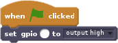
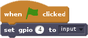
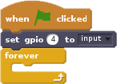

Using Scratch Pi GPIO you can use a button in your Scratch projects.

- With Scratch open, the Pi GPIO extension added and a button connected to a GPIO pin, find the `when flag clicked` block and drag it into your scripts area.

	

- Find the `set gpio ( ) to [output high]` block, and drag it into you scripts area, so it connects with the other block.

	

- Next to the `[output high]` is a small arrow that you can click and change to `[input]`. This tells Scratch that the pin will be connected to an input, like a button. You also need to set it to the correct pin. In this case the example is using GPIO pin 4.

	

- One way of detecting button pushes is to use a `forever` loop, containing an `if else` block. Find the `forever` block in the *Control* menu and drag it into your scripts area. Then grab the `if else` block and place it into the loop.

	
	

- Next find the `gpio ( ) is high?` block, from *More Blocks* and drag it into you scripts area.

	

- Set the pin number to the same pin that you have wired your button to. This block can now be placed into the `if else` block.

	

- The pin will be `low` when the button is pushed and `high` when the button is not pushed. So you can use `say` blocks to show this.

	

- Here's a video showing you the whole process.

	<video width="560" height="315" controls>
	<source src="https://s3.eu-west-2.amazonaws.com/learning-resources-production/projects/rpi-scratch-button/9cd0dbdf96b7891efc2db6c449e3428f4d32c0c0/en/images/scratch-pi-gpio-button.webm" type="video/webm">
	Try using Firefox or Chrome for WebM support
	</video>

